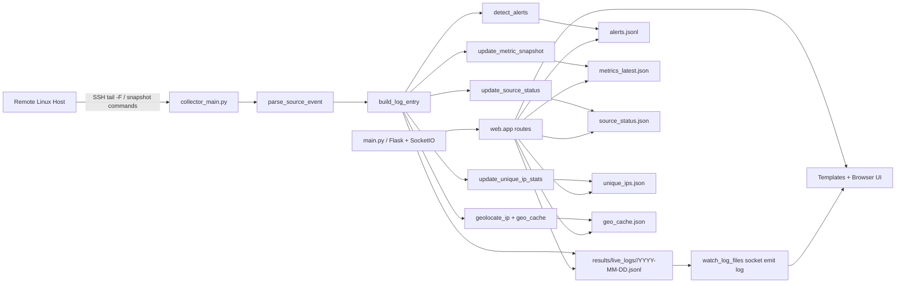

# VAPT Defender User Manual (In-Depth)

## 1) How To Run

### 1.1 Prerequisites
- Python 3.10+ recommended
- Remote Linux host reachable over SSH
- Read access to target logs/commands on remote host

Install core dependencies:

```powershell
pip install flask flask-socketio paramiko python-dotenv
```

### 1.2 Configure Environment
Edit `config/setup.env` with your server details:

```env
SERVER_HOST=<remote-host-ip-or-dns>
SERVER_USER=<ssh-username>
SERVER_PASSWORD=<ssh-password>
LOG_PATH=/var/log/nginx/access.log
```

Optional source path overrides (supported by code):
- `NGINX_ACCESS_LOG_PATH`
- `NGINX_ERROR_LOG_PATH`
- `AUTH_LOG_PATH`
- `SYSLOG_PATH`
- `PHP_FPM_ERROR_LOG_PATH`
- `CRON_LOG_PATH`
- `KERNEL_LOG_PATH`
- `ENABLED_SOURCES` (comma-separated, or `*` for all)

### 1.3 Start Processes (Two Terminals)
From project root:

Terminal 1 (collector):
```powershell
python collector_main.py
```

Terminal 2 (web dashboard):
```powershell
python main.py
```

### Screenshot Placeholder
`[Insert Screenshot: Terminal running collector_main.py with active source status updates]`

### Screenshot Placeholder
`[Insert Screenshot: Terminal running main.py showing Flask/SocketIO started on 127.0.0.1:5000]`

---

## 2) How To Access

Open:
- `http://127.0.0.1:5000/` (redirects to `/overview`)

The sidebar entry labels are:
- `Overview`
- `Web Traffic`
- `Host Health`
- `Security`
- `History`
- `Statistics`
- `Alert Queue`

---

## 3) Architecture Diagram



### Screenshot Placeholder
`[Insert Screenshot: Architecture diagram exported as image for report]`

---

## 4) Data Sources and Storage

### 4.1 Default enabled sources
If `ENABLED_SOURCES` is not set, collector enables:
- `nginx_access`
- `nginx_error`
- `disk_usage`
- `service_health`

### 4.2 Log tail sources (continuous)
- `nginx_access`, `nginx_error`, `auth_log`, `syslog`, `php_fpm_error`, `cron_log`, `kernel_log`

### 4.3 Snapshot sources (interval)
- `disk_usage` (60s)
- `memory_cpu` (60s)
- `service_health` (60s)
- `network_state` (120s)

### 4.4 Local files used by UI
- `results/live_logs/<source_id>/YYYY-MM-DD.jsonl`
- `results/live_logs/source_status.json`
- `results/live_logs/metrics_latest.json`
- `results/live_logs/alerts.jsonl`
- `results/live_logs/unique_ips.json`
- `results/live_logs/geo_cache.json`

---

## 5) Page-by-Page Guide (What It Contains and Says)

## 5.1 `/overview` (Overview)
Header text:
- Title: `Overview`
- Subtitle: `Live host health, source availability, and active risk posture at a glance.`

Contains:
- KPI cards: `Sources Online`, `Recent Alerts`, `Worst Disk Usage`, `Failed Services`
- Doughnut chart: `Alert Type Breakdown`
- Resource panel: CPU load, memory usage bar, network connection count
- Four detail cards:
  - `Source Status` (Online/Error/Offline badges)
  - `Disk Usage` (top filesystems with bars)
  - `Service Health` (failed/running states)
  - `Recent Alerts` (latest alert items)

### Screenshot Placeholder
`[Insert Screenshot: Overview page with all KPI cards and chart visible]`

## 5.2 `/traffic` (Web Traffic)
Header text:
- Title: `Web Traffic`
- Subtitle: `Live Nginx access stream, parsed structured view, and geographic origin map — all in one place.`

Tabs:
1. `Raw Stream`
   - Metrics: `Lines`, `Last update`
   - Controls: `Auto-scroll`, `Clear`
   - Panel message when empty: `Waiting for log stream…`
2. `Structured View`
   - Metrics: `Entries`, `Parsed`, `Unmatched`, `Last update`
   - Per-entry cards show method, path, status, IP, timestamp, bytes, user-agent, raw
3. `Origin Map`
   - Metrics: `Mapped IPs`, `Unique origins`, `Last update`
   - Controls: `Fit markers`
   - Country legend + map + live feed list

### Screenshot Placeholder
`[Insert Screenshot: Web Traffic - Raw Stream tab]`

### Screenshot Placeholder
`[Insert Screenshot: Web Traffic - Structured View tab]`

### Screenshot Placeholder
`[Insert Screenshot: Web Traffic - Origin Map tab]`

## 5.3 `/health` (Host Health)
Header text:
- Title: `Host Health`
- Subtitle: `Disk usage, service state, and resource telemetry — live snapshots from the remote host.`

Tabs:
1. `Disk`:
   - Filesystem count, last snapshot time, usage bars, inode bars, disk table
2. `Services`:
   - Failed count, observed services, last snapshot, filter box, state/substate table
3. `Resources`:
   - CPU load (1m/5m/15m), memory usage %, network connection count/sample, source status badges

### Screenshot Placeholder
`[Insert Screenshot: Host Health - Disk tab]`

### Screenshot Placeholder
`[Insert Screenshot: Host Health - Services tab]`

### Screenshot Placeholder
`[Insert Screenshot: Host Health - Resources tab]`

## 5.4 `/security` (Security)
Header text:
- Title: `Security`
- Subtitle: `Authentication activity, login failure patterns, brute-force alerts, and error streams — all in one view.`

Tabs:
1. `Auth Log`
   - Metrics: auth event count, brute-force count, last update
   - Filters: `All`, `Failed`, `Accepted`, `Invalid`
   - Search placeholder: `Search IP, user…`
   - Table columns: Time, Action, Result, User, IP, Message
2. `Error Streams`
   - Metrics: errors shown, last update
   - Filters by source: All/Nginx/PHP-FPM/Syslog/Kernel
   - Search placeholder: `Search message…`
   - Table columns: Source, Time, Level, Message

### Screenshot Placeholder
`[Insert Screenshot: Security - Auth Log tab with filters]`

### Screenshot Placeholder
`[Insert Screenshot: Security - Error Streams tab]`

## 5.5 `/history` (History Browser)
Header text:
- Title: `History Browser`
- Subtitle: `Browse locally captured logs by source and date. No remote history reads are performed.`

Contains:
- Left panel: source list and date list
- Search box: `Search entries…`
- Right panel: historical entries (up to API limit) showing timestamp + message/path/raw
- Meta text: `Showing X of Y entries`

### Screenshot Placeholder
`[Insert Screenshot: History page with source/date selected and results list]`

## 5.6 `/stats` (Unique IP Statistics)
Header text:
- Title: `Unique IP Statistics`
- Subtitle references backing file name (`unique_ips.json`)

Contains:
- Metrics: `Unique IPs`, `Total hits`, `Countries`, `Last update`
- Search: `Search IP or country…`
- Actions: `Export CSV`, `Export JSON`, `Export PDF`
- Table columns: IP, Country, First Seen, Last Seen, Hits, Recent Timestamps

### Screenshot Placeholder
`[Insert Screenshot: Statistics page with metrics and table]`

## 5.7 `/alerts` (Alert Queue)
Header text:
- Title: `Security Alerts`
- Subtitle explains monitored behaviors and persistence in `alerts.jsonl`

Contains:
- Metrics: `Shown`, `Total`, `Last alert`
- Dynamic filter bar by attack type (`All`, `Availability`, `Upload Abuse`, `SQLi`, `Brute Force`, etc.)
- Alert cards with:
  - title + severity pill
  - IP/country/time/method/status/attack type/rule
  - path + description
  - raw log block

### Screenshot Placeholder
`[Insert Screenshot: Alert Queue with multiple severity cards and active filter]`

---

## 6) Additional Direct URLs (Not Main Sidebar Navigation)

- `/structured` : standalone structured parser view (Nginx access)
- `/map` : standalone origin map view
- `/disk` : standalone disk-only page
- `/services` : standalone services-only page
- `/auth` : standalone auth-only page
- `/errors` : standalone error-only page
- `/stats/print` : print-friendly export page (auto print dialog)
- `/stats/export.csv` and `/stats/export.json` : download endpoints

---

## 7) Operational Notes

- Collector must run for fresh data; web app only reads local files.
- Socket updates are pushed from `watch_log_files()` scanning `results/live_logs/*/*.jsonl`.
- Geolocation is only attempted for `nginx_access` parsed entries with public IPs.
- Alerts include detection for traversal, SQLi, XSS, scanner paths, suspicious user-agent, brute-force/auth failures, service failure, disk pressure, and error spikes.

---

## 8) Recommended Screenshot Checklist

Use this list when preparing your final report:
1. Collector terminal running
2. Web terminal running
3. Overview
4. Web Traffic (all 3 tabs)
5. Host Health (all 3 tabs)
6. Security (both tabs)
7. History
8. Statistics
9. Alerts
10. Architecture diagram image

